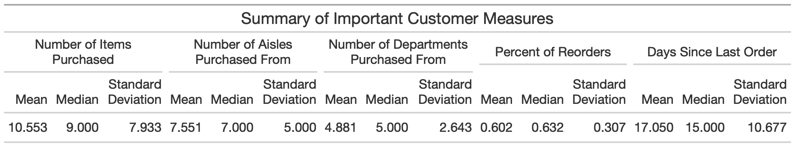
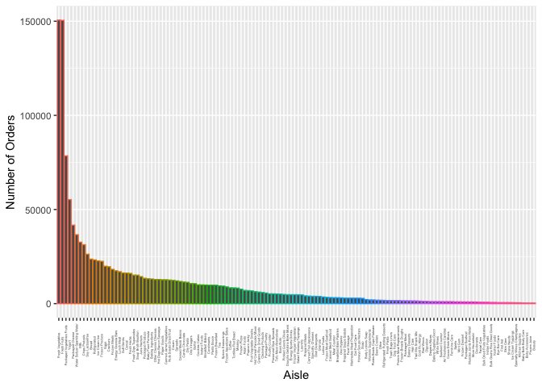
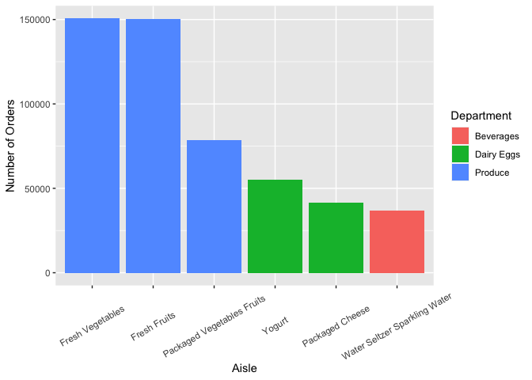
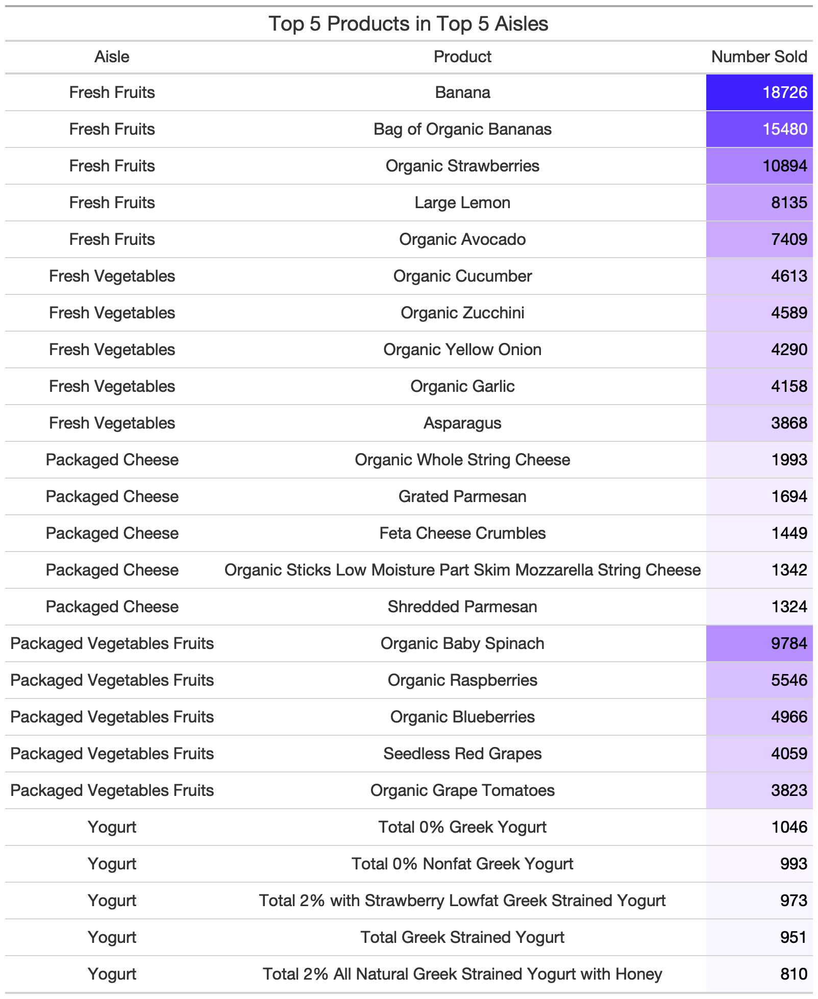

Homework 3
================
Seth Bergstedt
2/15/2022

``` r
cart = read.csv("./data/instacart.csv")

library(tidyverse)
library(gt)
library(webshot)
```

### 3.1

``` r
cart_3.1 = cart %>%
  group_by(user_id) %>%
  summarize(num_purchased = n(),
            num_aisles = length(unique(aisle_id)),
            num_departs = length(unique(department_id)),
            percent_reordered = mean(reordered),
            days_since_last_order = days_since_prior_order) %>%
  ungroup()  %>%
  unique() %>%
  mutate(across(.cols = num_purchased:days_since_last_order,
                .fns = list(mean = mean, median = median, sd = sd),
                .names = "{.col}_{.fn}")) %>%
  dplyr::select(num_purchased_mean:days_since_last_order_sd) %>%
  unique()
```

    ## `summarise()` has grouped output by 'user_id'. You can override using the `.groups` argument.

``` r
table_3.1 = gt(cart_3.1) %>%
  tab_header(title = "Summary of Important Customer Measures") %>%
  tab_spanner(label = "Number of Items Purchased",
              columns = num_purchased_mean:num_purchased_sd) %>%
  tab_spanner(label = "Number of Aisles Purchased From",
              columns = num_aisles_mean:num_aisles_sd) %>%
  tab_spanner(label = "Number of Departments Purchased From",
              columns = num_departs_mean:num_departs_sd) %>%
  tab_spanner(label = "Percent of Reorders",
              columns = percent_reordered_mean:percent_reordered_sd) %>%
  tab_spanner(label = "Days Since Last Order",
              columns = days_since_last_order_mean:days_since_last_order_sd) %>%
  cols_label(num_purchased_mean = "Mean",
             num_purchased_median = "Median",
             num_purchased_sd = "Standard Deviation",
             num_aisles_mean = "Mean",
             num_aisles_median = "Median",
             num_aisles_sd = "Standard Deviation",
             num_departs_mean = "Mean",
             num_departs_median = "Median",
             num_departs_sd = "Standard Deviation",
             percent_reordered_mean = "Mean",
             percent_reordered_median = "Median",
             percent_reordered_sd = "Standard Deviation",
             days_since_last_order_mean = "Mean",
             days_since_last_order_median = "Median",
             days_since_last_order_sd = "Standard Deviation") %>%
  fmt_number(columns = everything(),decimals = 3)

gtsave(table_3.1,"./figures/table_1.png")
```

<!-- -->


### 3.2

``` r
cart_3.2 = cart %>%
  group_by(aisle) %>%
  summarize(num_orders = n()) %>%
  mutate(aisle = fct_reorder(factor(str_to_title(aisle)),num_orders,.desc = TRUE))

ggplot(cart_3.2) +
  geom_col(aes(x = aisle,y = num_orders,color = aisle)) + 
  theme(axis.text.x = element_text(angle = 90,
                                   vjust = 0.5,
                                   size = 3),
        legend.position = "none") + 
  labs(x = "Aisle", y = "Number of Orders")
```

<!-- -->

### 3.3

I interpret the question as displaying the top 6 aisles within the top 6
departments (in other words, within the top 6 departments, what are the
top 6 aisles overall).

``` r
car_3.3 = cart %>%
  group_by(department,aisle) %>%
  summarize(num_orders_aisle = n()) %>%
  group_by(department) %>%
  summarize(num_orders_department = sum(num_orders_aisle),
            department,aisle,num_orders_aisle) %>%
  arrange(desc(num_orders_department)) %>%
  ungroup() %>%
  filter(department %in% unique(department)[1:6]) %>%
  arrange(desc(num_orders_aisle)) %>%
  slice(1:6) %>%
  mutate(Department = fct_reorder(factor(str_to_title(department)),num_orders_department),
         Aisle = fct_reorder2(factor(str_to_title(aisle)),num_orders_department,num_orders_aisle))
```

    ## `summarise()` has grouped output by 'department'. You can override using the `.groups` argument.
    ## `summarise()` has grouped output by 'department'. You can override using the `.groups` argument.

``` r
ggplot(car_3.3) + 
  geom_col(aes(x = Aisle,y = num_orders_aisle,fill = Department)) +
  theme(axis.text.x = element_text(angle = 30,
                                   vjust = 0.5)) + 
  labs(y = "Number of Orders")
```

<!-- -->

### 3.4

``` r
cart_3.4 = cart %>%
  group_by(aisle,product_name) %>%
  summarize(num_product = n()) %>%
  group_by(aisle) %>%
  summarize(num_aisle = sum(num_product),
            product_name,num_product) %>%
  ungroup() %>%
  arrange(desc(num_aisle)) %>%
  filter(aisle %in% unique(aisle)[1:5]) %>%
  group_by(aisle) %>%
  arrange(desc(num_product),.by_group = TRUE) %>%
  filter(product_name %in% unique(product_name)[1:5]) %>%
  ungroup() %>%
  mutate(Aisle = fct_reorder(factor(str_to_title(aisle)),num_aisle),
         Product = fct_reorder2(factor(product_name),num_aisle,num_product)) %>%
  dplyr::select(Aisle,Product,num_product)
```

    ## `summarise()` has grouped output by 'aisle'. You can override using the `.groups` argument.
    ## `summarise()` has grouped output by 'aisle'. You can override using the `.groups` argument.

``` r
tab_2 = gt(cart_3.4) %>%
  tab_header(title = "Top 5 Products in Top 5 Aisles") %>%
  data_color(columns = "num_product",
             colors = scales::col_numeric(
               palette = c("white","blue"),
               domain = c(100,20000)
             )) %>%
  cols_label(num_product = "Number Sold") 

gtsave(tab_2,"./figures/table_2.png")
```

<!-- -->


